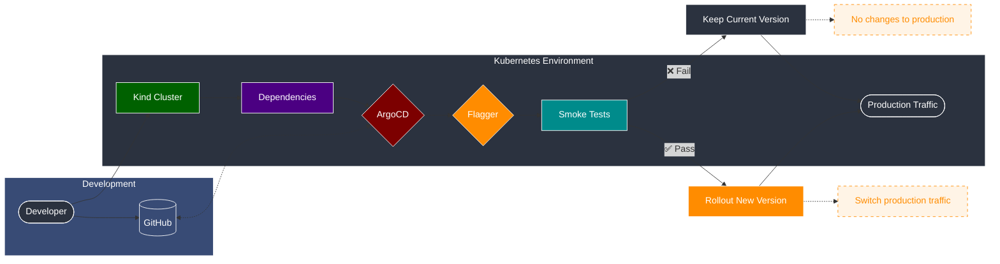
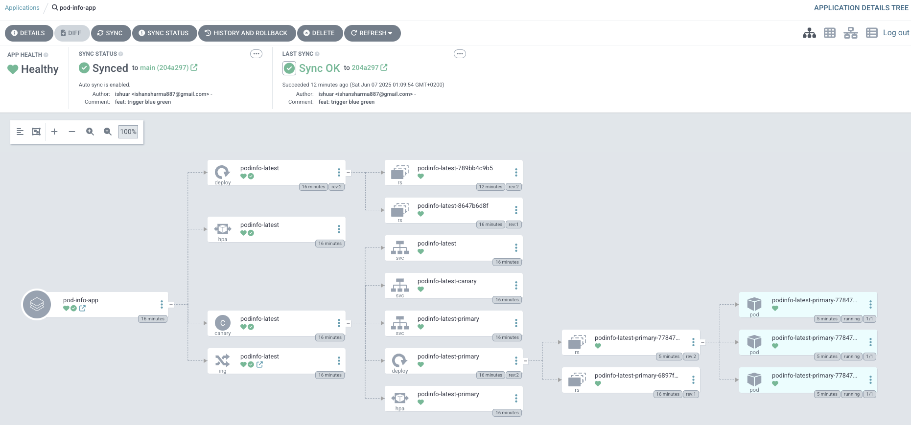

# Local Kubernetes Development Environment with Kind

This project sets up a complete local Kubernetes development environment using Kind (Kubernetes in Docker) with advanced deployment capabilities including GitOps, progressive delivery.

# Deployment Flow Diagram

## Blue Green

The following diagram illustrates the deployment workflow in our local Kubernetes environment using Kind, ArgoCD, and Flagger.



## Flow Description

1. **Cluster Creation**: Developer creates a local Kubernetes cluster using Kind
2. **Dependencies Installation**: Required components are installed in the cluster:
   - Nginx Ingress Controller
   - Flagger
   - ArgoCD
3. **Configuration**: Developer pushes workload configurations to GitHub repository
4. **GitOps Sync**: ArgoCD monitors and syncs configurations from GitHub
5. **Progressive Delivery**: Flagger orchestrates the deployment:
   - Implements blue/green deployment strategy
   - Runs smoke tests to verify new version:
     - ✅ Pass: Triggers rollout of new version and switches production traffic
     - ❌ Fail: Maintains current version with no changes to production
6. **Traffic Management**:
   - On success: New version becomes production traffic
   - On failure: Current version remains unchanged

## Quick Start

```bash
# Make the setup script executable
chmod +x setup.sh

# Run the setup script
./setup.sh
```

## Project Structure

```bash
.
├── argocd/                  # ArgoCD Configuration
│   ├── application.yaml     # ArgoCD application manifest for PodInfo deployment
│   ├── this-repository.yaml # Git repository credentials for ArgoCD
│   └── values.yaml          # Custom values for ArgoCD helm installation
│
├── config/                       # Kubernetes & Kind Configuration
│   ├── config.yaml               # Kind cluster configuration
│   ├── deploy-ingress-nginx.yaml # Nginx ingress controller configuration
│   ├── kustomization.yaml        # Kustomize configuration for ingress
│   └── namespace.yaml            # Namespace definitions
│
├── logs/                   # Logging Tools
│   └── curl-logger.sh      # Utility script for logging HTTP requests
│
├── workloads/              # Application Workloads
│   ├── blue-green.yaml     # Blue-Green deployment configuration
│   ├── deployment.yaml     # Main application deployment
│   ├── hpa.yaml            # Horizontal Pod Autoscaling
│   ├── ingress.yaml        # Ingress rules
│   ├── kustomization.yaml  # Workload kustomization
│   ├── namespace.yaml      # Application namespace
│   └── normal-canary.yaml  # Canary deployment configuration
```

## Features

- **Local Kubernetes Cluster**: Kind-based cluster.
- **Ingress Controller**: Nginx ingress for local domain routing
- **Progressive Delivery**:
  - Flagger for automated canary deployments
  - Support for both Canary and Blue/Green deployment strategies
- **GitOps**:
  - ArgoCD for declarative deployments
  - Automated sync and self-healing capabilities
- **Monitoring**:
  - Prometheus integration via Flagger
  - Built-in metrics collection
- **Load Testing**: Integrated load testing capabilities with Flagger's load tester

## Component Details

### Ingress Controller
- Uses Nginx ingress controller
- Configured for localhost access
- Supports path-based routing

> [!Note]
> ref: https://kind.sigs.k8s.io/docs/user/ingress

### ArgoCD (GitOps)
- Automated deployment synchronization
- Git repository integration
- Self-healing capabilities
- Web UI for deployment visualization
> [!Note]
> 
### Flagger (Progressive Delivery)
- Automated canary deployments
- Metric-based promotion/rollback
- Traffic shifting
- Load testing integration

### Demo Application (PodInfo)
- Sample application for testing deployments
- Supports canary and blue/green deployments
- Includes health checks and metrics endpoints
- Resource limits and requests configured

> [!Important]
> Improvements: @ Cloud InfraStructure
- Consider Helm Chart for better distribution.
- Configure Topology Constraints
- IRSA if required
- Configure Pod Disruption Budget
- Appropriate Toleration or NodeSeclectors.

## Reference Documentation
- [Kind Documentation](https://kind.sigs.k8s.io/docs/)
- [Flagger Documentation](https://docs.flagger.app/)
- [ArgoCD Documentation](https://argo-cd.readthedocs.io/)
